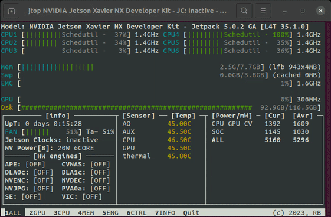

jetson-stats
============

.. toctree::
   :hidden:
   :maxdepth: 3

   rnext.it<https://rnext.it>
   Community Discord<https://discord.gg/BFbuJNhYzS>
   sponsors
   jtop/jtop
   advanced-usage
   docker
   reference/index
   other-tools/index
   troubleshooting
   contributing
   GitHub <https://github.com/rbonghi/jetson_stats>
   nosudo
   thor_podgov_tuning

.. toctree::
   :hidden:
   :caption: Project

   ros_jetson_stats<https://github.com/rbonghi/ros_jetson_stats>
   isaac_ros_jetson<https://nvidia-isaac-ros.github.io/repositories_and_packages/isaac_ros_jetson/index.html>
   Grafana plugin<https://grafana.com/grafana/dashboards/14493-nvidia-jetson>

jetson-stats is a package for monitoring and control your NVIDIA Jetson [Thor, Orin, Xavier, Nano, TX] series. Works with all NVIDIA Jetson ecosystem.

Installing
----------

jetson-stats can be installed with `pip <https://pip.pypa.io>`_

.. code-block:: bash

   sudo pip3 install -U jetson-stats

Don't forget to **logout/login** or **reboot** your board

**🚀 That's it! 🚀** 

Run
---

Start jtop it's pretty simple just write `jtop`!

.. code-block:: bash

   jtop

A simple interface will appear on your terminal, more capabilities are documented at :doc:`jtop/jtop` page.

Advanced usage
--------------

The more in-depth :doc:`advanced-usage` guide is the place to jtop such a python library and use for your project.

.. code-block:: python

   from jtop import jtop

   with jtop() as jetson:
      # jetson.ok() will provide the proper update frequency
      while jetson.ok():
         # Read tegra stats
         print(jetson.stats)

The :doc:`reference/index` documentation provides API-level documentation.

Compatibility
-------------

jetson-stats is compatible with:

* NVIDIA Clara AGX (experimental)
* NVIDIA Jetson AGX Thor
* NVIDIA Jetson Orin Series
   * NVIDIA Jetson Orin Nano
   * NVIDIA Jetson Orin NX
   * NVIDIA Jetson AGX Orin
   * NVIDIA Jetson IGX Orin (experimental)
* NVIDIA Jetson Xavier Series
   * NVIDIA Jetson AGX Xavier Industrial
   * NVIDIA Jetson AGX Xavier
   * NVIDIA Jetson Xavier NX
* NVIDIA Jetson Nano
* NVIDIA Jetson TX Series
   * NVIDIA Jetson TX2 NX
   * NVIDIA Jetson TX2i
   * NVIDIA Jetson TX2
   * NVIDIA Jetson TX1
* NVIDIA Jetson TK1
* Nintendo Switch

If you need a specific Compatibility open an `issue <https://github.com/rbonghi/jetson_stats/issues/new?assignees=&labels=Hardware%2Cmissing&template=hardware-missing.md&title=Hardware+Missing+%5B%5D>`_.

License
-------

jetson-stats is made available under the AGPL-3.0 license. For more details, see `LICENSE <https://github.com/rbonghi/jetson_stats/blob/master/LICENSE>`_.

Contributing
------------

We happily welcome contributions, please see :doc:`contributing` for details.
