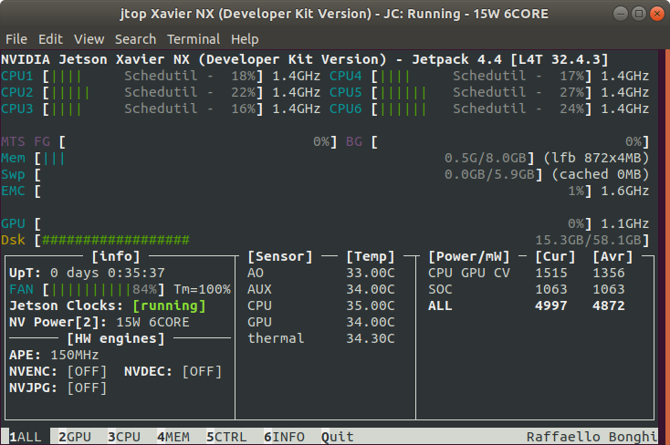
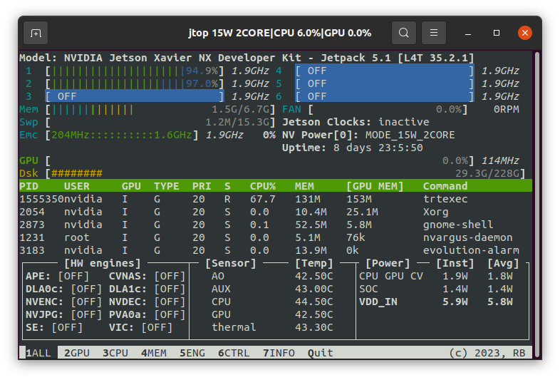

📊 jtop
=======

.. currentmodule:: jtop

jtop can be installed with `pip <https://pip.pypa.io>`_

.. code-block:: bash

  sudo -H pip3 install -U jetson-stats

Don't forget to **logout** or **reboot** your board

Run jtop
--------

Simple and fast! You can write on your shell **jtop** and that's it!

.. code-block:: bash

  jtop

Other options are available with ``-h`` option:

.. code-block:: console
  :class: no-copybutton

  nvidia@agx-orin:~$ jtop -h
  usage: jtop [-h] [--no-warnings] [--restore] [--loop] [--color-filter] [-r REFRESH] [-p PAGE] [-v]

  jtop is system monitoring utility and runs on terminal

  optional arguments:
    -h, --help            show this help message and exit
    --health              Status jtop and fix (default: False)
    --error-log           Generate a log for GitHub (default: False)
    --no-warnings         Do not show warnings (default: False)
    --restore             Reset Jetson configuration (default: False)
    --loop                Automatically switch page every 5s (default: False)
    --color-filter        Change jtop base colors, you can use also JTOP_COLOR_FILTER=True (default: False)
    -r REFRESH, --refresh REFRESH
                          refresh interval (default: 500)
    -p PAGE, --page PAGE  Open fix page (default: 1)
    -v, --version         show program\'s version number and exit

You can change page using *left*, *right* arrow or *TAB* to change page.

Pages
^^^^^

**jtop** have four different pages to control your NVIDIA Jetson:

1. **ALL** Are collected all information about your board: CPUs status, Memory, *GPU*, disk, fan and all status about jetson_clocks, NVPmodel and other
2. **GPU** A real time GPU history about your NVIDIA Jetson
3. **CPU** A real time CPU plot of NVIDIA Jetson
4. **MEM** A real time Memory chart and swap monitor
5. **ENG** A real time list with the status of all engines
6. **CTRL** Enable/Disable **jetson_clocks**, **nvpmodel** or **fan** directly from here
7. **INFO** All information about libraries, CUDA, Serial Number, interfaces, ...

Controls
^^^^^^^^

To control the your NVIDIA Jetson are available this keyboard commands:

In page **4 MEM**:

* **c** Clear cache
* **s** Enable/Disable extra swap
* **+** and **-** Increase and decrease swap size

In page **5 CTRL**:

* **a** Start/Stop jetson_clocks service (Note: jetson_clocks start only after 60s from up time)
* **e** Enable/Disable jetson_clocks on board boot
* **+** and **-** Increase and decrease the NVPmodel
* **f** Manual/jetson_clocks mode for your fan
* **p** and **m** Increase and decrease the Fan speed

Options
-------

There are different options available for jtop

Health
^^^^^^

If something goes wrong, you can check the ``jtop`` status with

.. code-block:: console

  jtop --health

.. image:: /images/jetson_config-02-jtop.png
   :align: center

This tool, will check and fix:

- **jetson-stats** - Fix jetson-stats service
- **Permissions** - Fix permissions for your user
- **variables** - Check if are installed all variables :doc:`other-tools/environment_variables`

Restore
^^^^^^^

If you want to restore the original board configuration you can simply write

.. code-block:: console

  jtop --restore

.. image:: images/jtop-restore.png
   :align: center

This command will restore the original configuration of:

- ``jetson_clocks``
- fan
- jtop configuration

Color filter
^^^^^^^^^^^^

This option change the red color for text and background to blue.

To enable this feature you can add this option

.. code-block:: console

  jtop --color-filter

or you can add in your ``.bashrc``

.. code-block:: bash

  JTOP_COLOR_FILTER=True

The output will be like the image below

Error-log
^^^^^^^^^

If your board is not included, jetpack missing, hardware missing, you can launch this script

.. code-block:: console

  jtop --error-log

This script generate a file ``jtop-error.log`` ready to be attached on your issue

How it's works
--------------

jtop use a service to sharing the data between client (jtop gui or your python script) and a server.

This service, called ``jtop.service`` use a socket file. It is located in:

.. code-block:: console
  :class: no-copybutton

  /run/jtop.sock

This socket is protected by access mode: **660** equivalent to ``srw-rw----`` and by the group.

Only other users in ``jtop`` have access to this socket
